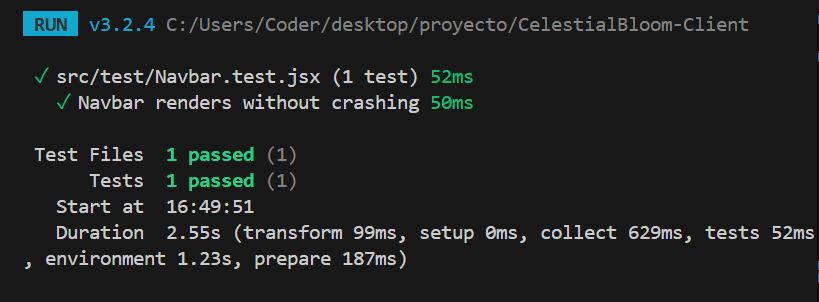

# CelestialBloom-Client

## Descripción

CelestialBloom-Client es un proyecto desarrollado por Sylva-Organization con el objetivo de ofrecer una plataforma moderna, eficiente y escalable para [describe aquí el contexto de uso, por ejemplo: gestión de usuarios, visualización de datos astronómicos, etc.]. Este cliente se integra con el backend de CelestialBloom para proporcionar una experiencia integral y optimizada.

## Características principales

- Interfaz de usuario intuitiva y responsiva.
- Integración total con la API de CelestialBloom.
- Autenticación y gestión de usuarios.
- Visualización dinámica de datos.
- Configuración personalizada y soporte multilenguaje.
- Seguridad y rendimiento optimizados.
- [Agrega aquí cualquier funcionalidad diferencial importante.]

## Arquitectura del proyecto

La estructura típica de carpetas y archivos es la siguiente (adapta según tu proyecto):

```
CelestialBloom-Client/
│
├── src/                # Código fuente principal
│   ├── components/     # Componentes reutilizables de UI
│   ├── pages/          # Vistas y páginas principales
│   ├── services/       # Módulos de comunicación con APIs
│   ├── utils/          # Funciones de utilidad
│   ├── assets/         # Imágenes, estilos y recursos
│   └── App.js          # Componente raíz
│
├── public/             # Archivos públicos 
├── .env.example        # Variables de entorno necesarias
├── package.json        # Dependencias y scripts
├── README.md           # Documentación del proyecto
```

**Relaciones entre módulos:**  
- Los servicios se encargan de la lógica de negocio y comunicación con la API.
- Los componentes conforman la UI y se comunican entre sí mediante props y estados.
- Las páginas agrupan componentes y definen rutas.

**Base de datos:**  
_Este cliente no gestiona la base de datos directamente; la estructura de tablas y relaciones corresponde al backend. Puedes incluir aquí un diagrama o capturas de pantalla de la base de datos si lo deseas._

## Implementación y uso

### Instalación

```bash
git clone https://github.com/Sylva-Organization/CelestialBloom-Client.git
cd CelestialBloom-Client
npm install
```

### Configuración

Renombra el archivo `.env.example` a `.env` y completa las variables necesarias (como la URL de la API).

```env
URL_API=https://api.celestialbloom.com
# Agrega aquí otras variables necesarias
```

### Ejecución

```bash
npm start
```

La aplicación estará disponible en `http://localhost:3000`.

### Pruebas

```bash
npm test
```

## Ejemplo de uso

- Inicia sesión con tu usuario registrado.
- Accede a la vista principal para visualizar los datos.
- Configura preferencias desde el panel de usuario.

## Tecnologías

- **Lenguajes:** JavaScript
- **Frameworks:** React, SweetAlert2, Cloudinary, Zustand
- **Librerías:** React Router
- **Herramientas:** Node.js, npm, ESLint, Prettier

## Capturas de pantalla

Test TDD Navbar

```


```

## Variables de entorno

Consulta el archivo `.env.example` para ver todas las variables necesarias:

```env
VITE_UPLOAD_PRESET=
VITE_CLOUDINARY_FOLDER=
VITE_CLOUDINARY_URL=
```

## Licencia

Este proyecto está bajo la licencia MIT.

## Contacto

Para consultas o soporte, abre un issue o contacta al equipo en [Sylva-Organization](https://github.com/Sylva-Organization).

---

**¡Gracias por usar CelestialBloom-Client!**